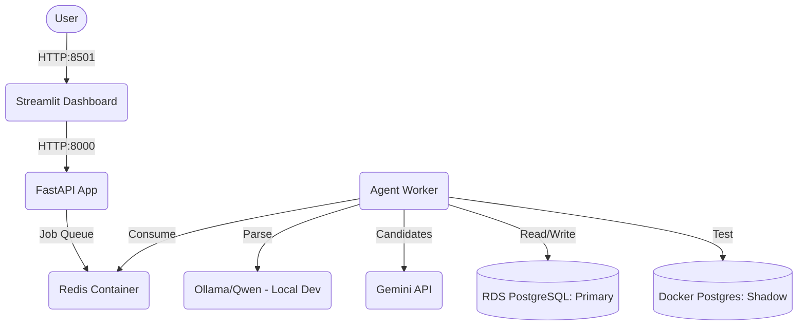

# AWS Deployment Roadmap (Free Tier / Free Plan)

This roadmap outlines the path to deploying DBAutonomy onto AWS using only Free Tier eligible resources. The objective is to minimize cost while ensuring the pipeline runs successfully.

## 1. Target Architecture Diagram

## 2. AWS Services
- **Amazon EC2**: Hosts FastAPI, Worker, Dashboard, Redis, and the Shadow PostgreSQL database.
- **Amazon RDS (Optional but recommended for Primary DB)**: Hosts the Primary PostgreSQL database.

## 3. Service Hosting Distribution
- **FastAPI**: EC2 (Docker)
- **Worker**: EC2 (Docker)
- **Dashboard**: EC2 (Docker)
- **Redis**: EC2 (Docker)
- **Shadow PostgreSQL**: EC2 (Docker - temporary experiments)
- **Primary PostgreSQL**: RDS (Managed DB) or EC2 (Docker)

## 4. EC2 Instance Choice
**Instance Type**: `t2.micro` or `t3.micro` (Free Tier eligible - 1 vCPU, 1 GB RAM).
*Constraint*: 1 GB RAM is extremely limited. We must limit the size of the shadow database and memory caches.
*AI Exception*: `qwen2.5-coder:3b` requires at least 4-8 GB of RAM. Running Ollama on a `t2.micro` will cause OOM crashes.
**Solution**: See "Hybrid Architecture" below.

## 5. RDS PostgreSQL Choice
**Instance Type**: `db.t3.micro` (Free Tier eligible - 20 GB General Purpose SSD).
*Note*: Using RDS simplifies primary database management and simulates a real-world separation of application and data.

## 6. Networking
- **VPC**: Default VPC
- **Subnets**: Public Subnet (for EC2), Private/Public for RDS.

## 7. Security Groups
- **EC2 SG**: 
  - Allow Inbound TCP 8501 (Dashboard) from `0.0.0.0/0` (or restricted IP)
  - Allow Inbound TCP 22 (SSH) from Admin IP
- **RDS SG**:
  - Allow Inbound TCP 5432 from EC2 SG only.

## 8. Ports
- Dashboard: 8501
- FastAPI: 8000 (Internal to EC2)
- Redis: 6379 (Internal to EC2)
- Shadow DB: 5433 (Internal to EC2)
- Primary DB: 5432 (External RDS)

## 9. Environment Variables
To be injected via `.env` on EC2:
- `AI_MODE=real`
- `GEMINI_API_KEY=...`
- `DB_HOST=<RDS Endpoint>`
- `DB_USER=...`
- `DB_PASSWORD=...`
- `OLLAMA_BASE_URL=http://<Local_Laptop_IP>:11434` (Hybrid setup)

## 10. Secrets Handling
Since this is a simple Free Tier deployment, secrets will be securely transferred via SCP/SSH directly into an `.env` file on the EC2 instance. (Do not use AWS Secrets Manager to strictly avoid outside-free-tier charges).

## 11. Docker Deployment
Use Docker Compose to spin up: `app`, `worker`, `dashboard`, `redis`, and `db_shadow`. 

## 12. Hybrid Architecture (CRITICAL AVOIDANCE OF COSTS)
**The Problem**: The Qwen model requires several gigabytes of RAM. Upgrading to a `t3.large` or `t3.xlarge` EC2 instance will incur immediate hourly charges (not free tier eligible).
**The Solution**: Hybrid Mode.
- Run Ollama locally on the developer's laptop.
- Expose the laptop's Ollama port via `ngrok` or static IP.
- Point the EC2 `OLLAMA_BASE_URL` to the `ngrok` URL.
- The EC2 instance will handle everything else (orchestration, bandit, shadow DB, dashboard).

## 13. Shutdown / Cleanup
- Run `docker compose down -v` to remove containers and volumes.
- Terminate the EC2 instance (don't just stop it, to avoid EBS storage charges).
- Delete the RDS instance (skip snapshot to avoid storage charges).

## 14. Potential Unexpected Charges
- **EBS Storage**: Free tier includes 30GB. Do not provision more.
- **Data Transfer**: Free tier includes 100GB out.
- **RDS Snapshots**: Delete automated snapshots when terminating.
- **Elastic IPs**: Idle Elastic IPs cost money. Use auto-assigned public IPs.
